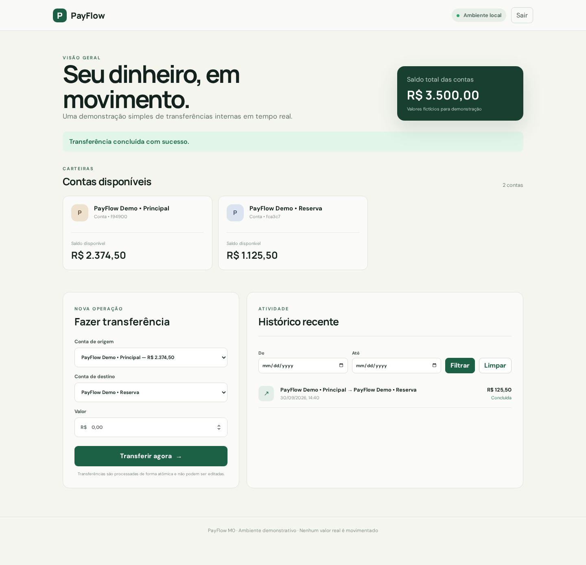

# PayFlow

PayFlow é uma aplicação de portfólio para demonstrar um fluxo financeiro completo: autenticação, contas, transferências, persistência, publicação em cloud e, em etapas posteriores, processamento assíncrono e auditoria.

O projeto começa intencionalmente pequeno:

```text
React + TypeScript -> Spring Boot -> PostgreSQL
```

A primeira versão pública será um **monólito modular**, executado com Docker Compose em uma única instância AWS. Kafka, MongoDB, WebFlux e serviços separados só entram quando existir um caso de uso que justifique cada tecnologia.

## M0 disponível localmente

O primeiro fluxo vertical já inclui contas fictícias, transferência atômica, atualização de saldos e histórico.

O fluxo inclui cadastro e login no React, senha protegida por BCrypt, autenticação JWT e contas
isoladas por usuário. O token fica no `sessionStorage`: sobrevive à atualização da página na mesma aba
e é descartado ao sair ou ao encerrar a sessão do navegador.

### Executar tudo com Docker

Pré-requisito: Docker com Compose.

```bash
docker compose up --build
```

Acesse <http://localhost:5173>. A API fica em <http://localhost:8080/api/v1>, a documentação interativa em <http://localhost:8080/swagger-ui.html> e o health check em <http://localhost:8080/actuator/health>.

Para encerrar, execute `docker compose down`. Os dados permanecem no volume `payflow-data`. Para também apagar os dados fictícios e recriar o seed, execute `docker compose down -v`.

### Executar com Kafka local opcional

O fluxo comum não precisa de Kafka. Para estudar a publicação assíncrona da outbox no M3, combine o
Compose base com o arquivo opcional:

```bash
docker compose -f compose.yaml -f compose.events.yaml up --build --wait
```

Nesse modo, a API publica `TransferCompleted.v1` no tópico
`payflow.transfer-completed.v1` e o módulo de auditoria consome cada evento uma única vez do ponto de
vista do efeito persistido. Para visualizar os eventos:

```bash
docker compose -f compose.yaml -f compose.events.yaml exec kafka \
  /opt/kafka/bin/kafka-console-consumer.sh \
  --bootstrap-server localhost:9092 \
  --topic payflow.transfer-completed.v1 \
  --from-beginning
```

Mensagens que continuam falhando após duas retentativas são preservadas no tópico de dead letter:

```bash
docker compose -f compose.yaml -f compose.events.yaml exec kafka \
  /opt/kafka/bin/kafka-console-consumer.sh \
  --bootstrap-server localhost:9092 \
  --topic payflow.transfer-completed.v1.DLT \
  --from-beginning
```

O relay tenta publicar cada outbox no máximo cinco vezes. Registros esgotados permanecem no banco
com `last_error` e `exhausted_at`; outboxes publicadas e mensagens Kafka são retidas por sete dias.

Para conferir as projeções de auditoria e os eventos já processados:

```bash
docker compose -f compose.yaml -f compose.events.yaml exec db \
  psql -U payflow -d payflow -c \
  'SELECT event_id, transfer_id, event_type, occurred_at FROM audit_events;'

docker compose -f compose.yaml -f compose.events.yaml exec db \
  psql -U payflow -d payflow -c \
  'SELECT consumer_name, event_id, processed_at FROM processed_events;'
```

Encerre esse ambiente usando os mesmos dois arquivos:

```bash
docker compose -f compose.yaml -f compose.events.yaml down
```

### Desenvolvimento

Suba somente o PostgreSQL:

```bash
docker compose up -d db
```

O PostgreSQL do PayFlow fica disponível em `localhost:5433`, evitando conflito com instalações locais na porta padrão.

Em dois terminais:

```bash
cd backend && mvn spring-boot:run
cd frontend && npm install && npm run dev
```

Testes e verificações:

```bash
npm run check
npm run check:e2e
```

`check` executa formatação, tipos, lint, cobertura, testes e builds do front e `mvn verify` no back. `check:e2e` reconstrói a aplicação completa e executa o fluxo Playwright. Os testes de integração e E2E precisam do Docker ativo.

## Primeiro produto publicável

O usuário poderá:

1. criar uma conta e entrar;
2. consultar saldo e histórico;
3. transferir um valor entre duas contas de demonstração;
4. consultar o resultado da transferência.

O release público inclui autenticação JWT, validação de saldo, transferência atômica e uma interface responsiva. Não movimenta dinheiro real e será identificado como ambiente de demonstração.

## Demonstração visual



As capturas são geradas a partir da aplicação real, com dados exclusivamente fictícios. Consulte a
[avaliação de prontidão do portfólio](docs/portfolio-readiness.md) para ver as evidências e limitações
da demonstração.

## Documentação

- [Plano de entrega](docs/plan.md)
- [Arquitetura](docs/architecture.md)
- [Modelo de classes](docs/domain-model.md)
- [Contrato inicial da API](docs/api.md)
- [Histórico de versões](CHANGELOG.md)
- [Processo de release](docs/releases/README.md)
- [Ambientes e promoção](docs/environments.md)
- [Observabilidade](docs/observability.md)
- [Prontidão do portfólio](docs/portfolio-readiness.md)
- [Decisões arquiteturais](docs/adr/README.md)
- [Infraestrutura AWS com Terraform](infra/README.md)
- [Runtime de produção com Compose e Caddy](deploy/README.md)

## Estado

M0, M1, M2 e M3 estão concluídos. A versão
[`v0.4.0`](https://github.com/WilliamRochaJR/pay-flow/releases/tag/v0.4.0) acrescenta eventos ao
monólito, com outbox transacional, Kafka local, auditoria deduplicada e tratamento operacional de
falhas, sem manter nova infraestrutura AWS ligada.

## Licença

Este projeto está disponível sob a [MIT License](LICENSE). Reutilizações e distribuições devem
preservar o aviso de copyright e o texto da licença.

Copyright © 2026 William Rocha JR.
