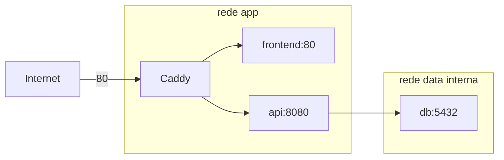

# Runtime de produção

O runtime inicial usa Docker Compose em uma única EC2. Somente Caddy publica portas no host; os
demais serviços se comunicam pelas redes privadas do Compose.



## Validar localmente

O arquivo de exemplo usa `localhost` e HTTP `8088` para evitar conflito com o Compose de
desenvolvimento:

```bash
docker compose --env-file .env.production.example -f compose.prod.yaml config --quiet
docker compose --env-file .env.production.example -f compose.prod.yaml up --build --wait
curl http://localhost:8088/
curl http://localhost:8088/health
PLAYWRIGHT_BASE_URL=http://localhost:8088 \
  npm --prefix frontend run test:e2e
docker compose --env-file .env.production.example -f compose.prod.yaml down
```

O endereço `:80` no Caddy força HTTP durante a fase sem domínio. Quando um domínio for adotado, o
endereço do site poderá ser alterado para o hostname e o Caddy voltará a automatizar HTTPS.

## Produção

Copie `.env.production.example` para `.env.production`, substitua todos os valores e restrinja o
arquivo:

```bash
cp .env.production.example .env.production
chmod 600 .env.production
docker compose --env-file .env.production -f compose.prod.yaml config --quiet
```

Para a PoC pública temporária sem domínio:

```text
PAYFLOW_SITE_ADDRESS=:80
APP_PUBLIC_ORIGIN=http://<elastic-ip-temporario>
HTTP_PORT=80
```

No futuro, com domínio, use `PAYFLOW_SITE_ADDRESS=payflow.seudominio.com` e a origem HTTPS
correspondente.

Nunca execute `docker compose config` sem `--quiet` em logs públicos: a saída expandida contém os
valores das variáveis, incluindo secrets. O arquivo real `.env.production` é ignorado pelo Git.

`docker compose down` preserva os volumes. Não use `down --volumes` em produção, pois isso removeria
o volume do PostgreSQL e os dados do Caddy.
