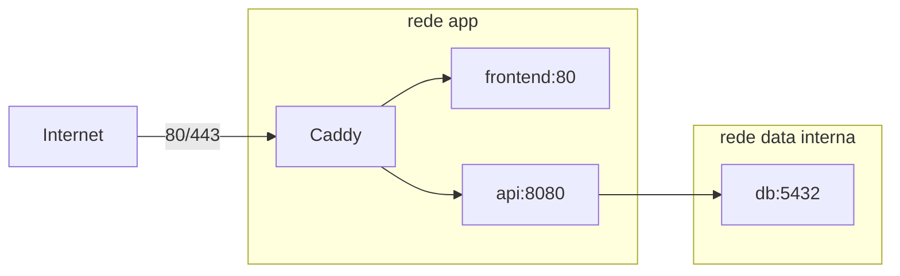

# Runtime de produção

O runtime inicial usa Docker Compose em uma única EC2. Somente Caddy publica portas no host; os
demais serviços se comunicam pelas redes privadas do Compose.



## Validar localmente

O arquivo de exemplo usa `localhost`, HTTP `8088` e HTTPS `8443` para evitar conflito com o Compose
de desenvolvimento:

```bash
docker compose --env-file .env.production.example -f compose.prod.yaml config --quiet
docker compose --env-file .env.production.example -f compose.prod.yaml up --build --wait
curl --insecure https://localhost:8443/
curl --insecure https://localhost:8443/health
PLAYWRIGHT_BASE_URL=https://localhost:8443 \
PLAYWRIGHT_IGNORE_HTTPS_ERRORS=true \
  npm --prefix frontend run test:e2e
docker compose --env-file .env.production.example -f compose.prod.yaml down
```

`--insecure` é usado somente porque o Caddy emite uma CA local para `localhost`. No domínio público,
o certificado será validado normalmente e esse parâmetro não deve ser usado.

## Produção

Copie `.env.production.example` para `.env.production`, substitua todos os valores e restrinja o
arquivo:

```bash
cp .env.production.example .env.production
chmod 600 .env.production
docker compose --env-file .env.production -f compose.prod.yaml config --quiet
```

Para o servidor público:

```text
PAYFLOW_DOMAIN=payflow.seudominio.com
APP_PUBLIC_ORIGIN=https://payflow.seudominio.com
HTTP_PORT=80
HTTPS_PORT=443
```

Nunca execute `docker compose config` sem `--quiet` em logs públicos: a saída expandida contém os
valores das variáveis, incluindo secrets. O arquivo real `.env.production` é ignorado pelo Git.

`docker compose down` preserva os volumes. Não use `down --volumes` em produção, pois isso removeria
o volume do PostgreSQL e os dados do Caddy.
