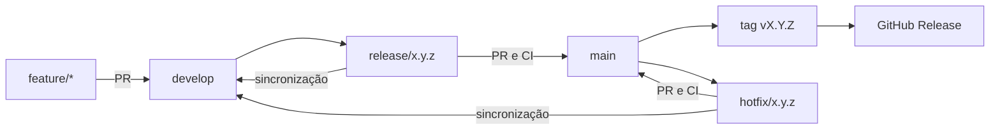

# ADR-0020 — Git Flow, promoção entre ambientes e versionamento semântico

- Status: Aceito
- Data: 2026-09-22
- Substitui: [ADR-0008](0008-github-flow.md)

## Contexto

O GitHub Flow foi suficiente para construir e publicar o M1 com uma única linha integrável. O PayFlow
também é um projeto de estudo e portfólio: além de entregar funcionalidades, deve permitir praticar um
processo empresarial com integração contínua, preparação de release, homologação, correção urgente e
identificação inequívoca da versão publicada.

O repositório ainda não possui tags, GitHub Releases, `CHANGELOG.md`, branches permanentes de
integração ou ambientes AWS além de `production`. Adicionar esses elementos sem uma convenção comum
criaria divergência entre branches, versões e ambientes. Ao mesmo tempo, manter três infraestruturas
AWS permanentemente ligadas não é compatível com o objetivo de baixo custo da PoC.

## Decisão

Adotar Git Flow clássico de forma incremental, usando comandos nativos do Git e Pull Requests. A
extensão `git-flow` não será obrigatória.

### Branches

- `main` contém somente versões liberadas e permanece protegida;
- `develop` é a branch permanente de integração do próximo release e permanece protegida;
- `feature/*`, `fix/*`, `refactor/*`, `test/*`, `docs/*` e `ci/*` nascem de `develop` e retornam a
  `develop` por Pull Request;
- `release/<versão>` nasce de `develop`, aceita apenas estabilização, documentação e ajuste de versão,
  e termina em `main` e `develop`;
- `hotfix/<versão>` nasce de `main`, corrige uma versão publicada e termina em `main` e `develop`.

Commits diretos em `main` e `develop` não são permitidos. Os jobs obrigatórios da CI devem proteger
ambas. Exceções administrativas precisam ser raras, justificadas e auditáveis.

### Versionamento e release

Usar Semantic Versioning no formato `MAJOR.MINOR.PATCH`:

- `MAJOR`: mudança incompatível em contrato ou comportamento público;
- `MINOR`: funcionalidade compatível;
- `PATCH`: correção compatível.

Enquanto o produto estiver em evolução como PoC, usar versões `0.x.y`. O primeiro release planejado
é `v0.1.0`. A versão de release deve ser igual no `backend/pom.xml`, no `package.json` da raiz e no
`frontend/package.json`. Em desenvolvimento, o Maven pode usar o sufixo `-SNAPSHOT`; a tag nunca deve
apontar para uma versão `SNAPSHOT`.

Cada release aprovado em `main` recebe uma tag anotada `vX.Y.Z` no commit exato aprovado e um GitHub
Release com notas da versão. Tags publicadas são imutáveis: uma correção gera uma nova versão, nunca a
movimentação ou reutilização de uma tag. Conventional Commits continua sendo a base para histórico e
futura automação das notas, mas a primeira adoção pode manter curadoria manual.

### Ambientes e promoção

Separar branch, finalidade e ambiente:

| Origem                      | Estágio        | Publicação AWS               |
| --------------------------- | -------------- | ---------------------------- |
| `feature/*` e Pull Requests | CI             | nenhuma                      |
| `develop`                   | `development`  | manual, efêmera e opcional   |
| `release/*`                 | `homologation` | manual e efêmera para aceite |
| tag `vX.Y.Z` em `main`      | `production`   | manual, efêmera e protegida  |

`development`, `homologation` e `production` serão GitHub Environments distintos. Quando um ambiente
AWS for implementado, deverá possuir state Terraform, lease de TTL, parâmetro SSM, secrets, variáveis,
tags e permissões OIDC próprios. Nenhum secret ou banco será compartilhado entre ambientes.

Os ambientes de cloud permanecem desligados por padrão. O uso de TTL e destruição automática vale
para todos, com tempos definidos operacionalmente em seus workflows. A existência de uma branch não
deve, sozinha, manter recursos AWS ativos.

Promoção significa selecionar uma revisão já validada. Durante a migração, os containers ainda podem
ser reconstruídos em cada publicação; uma evolução posterior deverá produzir artefatos imutáveis uma
vez e promovê-los entre ambientes.

### Migração

A adoção ocorrerá sem reescrever o histórico:

1. aprovar este ADR em `main` usando o GitHub Flow vigente;
2. criar `develop` a partir da `main` aprovada e configurar sua proteção;
3. adaptar a CI para Pull Requests e pushes de `develop`, `release/*` e `main`;
4. documentar e automatizar o primeiro `release/0.1.0`;
5. criar `development` e `homologation` somente quando seus workflows e isolamentos estiverem prontos;
6. restringir a publicação de `production` a tags aprovadas após concluir a migração.

Até cada etapa estar implementada, o workflow efêmero atual de `production` e suas proteções
continuam sendo a fonte operacional válida. O ADR não autoriza criar infraestrutura persistente nem
amplia permissões AWS automaticamente.

## Consequências

O projeto passa a demonstrar integração, estabilização, promoção e correção de releases, e cada
publicação pode ser ligada a uma versão rastreável. Em contrapartida, haverá mais branches de longa
duração, merges de sincronização e regras de proteção para manter.

A separação lógica de ambientes não garante isolamento até que state, identidade, secrets e recursos
tenham sido implementados separadamente. A estratégia efêmera reduz custo, mas exige nova publicação
quando um ambiente for necessário e continua sujeita a limites e cobranças da AWS.
