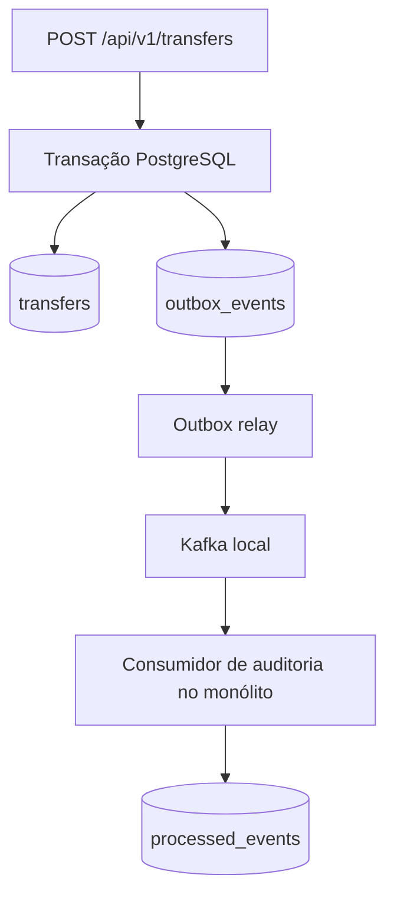

# ADR-0023 — Outbox transacional antes do Kafka

## Status

Aceito em 2026-09-29.

## Contexto

O fluxo financeiro síncrono está estável, mas efeitos secundários futuros, como auditoria e
notificação, não devem aumentar a latência nem comprometer a transferência. Publicar diretamente no
Kafka depois do commit cria uma janela em que a transferência existe no PostgreSQL, mas o evento pode
ser perdido. Publicar antes do commit cria o problema inverso: consumidores podem observar uma
transferência que depois seja revertida.

O projeto continua sendo uma PoC de baixo custo. Introduzir Kafka, serviço de auditoria, MongoDB e
infraestrutura gerenciada ao mesmo tempo tornaria difícil identificar qual decisão resolveu cada
necessidade.

## Decisão

Introduzir eventos em quatro incrementos demonstráveis, mantendo a API como monólito modular:

1. gravar uma linha em `outbox_events` na mesma transação PostgreSQL que conclui a transferência;
2. adicionar Kafka local como dependência opcional e publicar eventos pendentes por um relay interno;
3. consumir o evento em um módulo de auditoria dentro da mesma aplicação, com deduplicação
   persistente;
4. adicionar retries limitados, dead-letter topic e métricas antes de avaliar Kafka em cloud.

Kafka não participa da confirmação da transferência. PostgreSQL continua sendo a fonte de verdade do
saldo e do estado financeiro.

## Contrato inicial

Publicar `TransferCompleted.v1` como JSON, contendo somente dados necessários:

- `eventId`, UUID global usado para deduplicação;
- `eventType` e `eventVersion` explícitos;
- `occurredAt` em UTC;
- `correlationId` para rastreabilidade;
- `transferId` como identificador do agregado e chave da mensagem;
- `sourceAccountId`, `destinationAccountId`, `amount` como decimal textual e `currency`.

O evento não transportará nome, e-mail, senha, token ou outros dados pessoais. Mudanças incompatíveis
criam uma nova versão de evento; consumidores não dependem diretamente das entidades JPA.

## Semântica de entrega

A entrega será **pelo menos uma vez**. Depois de publicar, o relay marca o registro como publicado. Se
o processo cair entre essas operações, o evento pode ser reenviado. Por isso, o consumidor registra
`(consumer_name, event_id)` com restrição única antes de executar seu efeito observável.

O relay deve processar lotes pequenos e permitir concorrência segura com lock de linha e
`SKIP LOCKED`. Eventos que excederem o limite de tentativas deixam de bloquear o lote e seguem para a
estratégia de falha definida no quarto incremento.

## Limites desta decisão

- não extrair um microserviço no M3;
- não adicionar MongoDB, WebFlux ou Kubernetes;
- não colocar Kafka no caminho síncrono da transferência;
- não publicar infraestrutura Kafka na AWS sem um ADR específico de custo, segurança e operação;
- não prometer entrega exatamente uma vez entre PostgreSQL e Kafka.

## Consequências

A transferência e a intenção de publicar o evento passam a ser atômicas, enquanto a entrega aos
consumidores permanece assíncrona e tolerante a repetição. Em contrapartida, o sistema ganha tabelas
operacionais, um relay e rotinas de retenção e monitoramento.

Começar pela outbox permite testar a garantia principal antes de subir o broker. Kafka local será
opt-in para não tornar o ciclo comum de desenvolvimento mais pesado. A escolha de um serviço Kafka em
cloud fica adiada até existir necessidade demonstrável e uma opção compatível com o orçamento da PoC.

## Implementação incremental

O M3.1 foi implementado com a migration `V6__create_transactional_outbox.sql`. A conclusão de uma
transferência grava `TransferCompleted.v1` em `outbox_events` dentro da mesma transação. O reenvio da
mesma chave de idempotência devolve a transferência existente sem criar outro evento, e uma
transferência rejeitada não cria evento.

Os campos `attempts` e `published_at` foram incluídos desde a criação da tabela para suportar o relay
dos próximos incrementos. A política de retenção e o destino de eventos que excederem o limite de
tentativas serão implementados no M3.4, antes de qualquer operação contínua em cloud.

O M3.2 adicionou um relay interno, habilitado somente por configuração, e o Compose opcional
`compose.events.yaml`. O relay seleciona lotes ordenados com `FOR UPDATE SKIP LOCKED`, publica usando o
`transferId` como chave Kafka, espera a confirmação do broker e então preenche `published_at`. Se a
publicação ou o commit falhar, o evento continua elegível e pode ser reenviado. Kafka permanece fora
do Compose comum e do runtime AWS.

O M3.3 adicionou o consumidor `payflow-audit-v1` no mesmo monólito, também habilitado somente pelo
Compose opcional. Antes de gravar a projeção em `audit_events`, ele insere o par
`payflow-audit + eventId` em `processed_events`. A chave primária composta e o `ON CONFLICT DO
NOTHING` tornam a reivindicação atômica: entregas repetidas não repetem o efeito. A reivindicação e a
auditoria pertencem à mesma transação; se a segunda gravação falhar, ambas são revertidas.

## Critérios usados para aceitar este ADR

- contrato `TransferCompleted.v1` explícito, versionado e sem dados pessoais;
- retenção e tratamento de falhas reservados ao M3.4, antes da operação contínua;
- atomicidade, reenvio e deduplicação cobertos incrementalmente por testes;
- Kafka permanece local e opcional no M3, sem novo custo em cloud;
- auditoria permanece dentro do monólito durante o M3.
