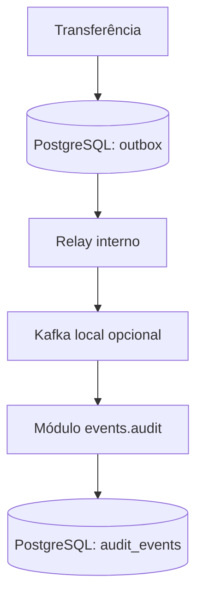

# ADR-0024 — Adiar a extração do Audit Service

## Status

Aceito em 2026-09-30.

## Contexto

O M3 entregou o contrato `TransferCompleted.v1`, a outbox transacional, o relay Kafka opcional e um
consumidor de auditoria deduplicado. O consumidor está isolado no módulo `events.audit`, mas ainda é
executado no mesmo processo da API e grava sua projeção no PostgreSQL.

O plano prevê como M4 a extração desse módulo para um serviço independente, com MongoDB, pipeline,
deploy e observabilidade próprios. Entretanto, no estado atual:

- Kafka permanece local e opcional; não existe broker em cloud;
- API e auditoria têm o mesmo proprietário e ciclo de release;
- não existe volume medido que exija escala independente;
- a auditoria não possui requisito de disponibilidade diferente da API;
- a projeção relacional atende às consultas e à deduplicação existentes;
- a infraestrutura AWS é efêmera e possui orçamento operacional de baixo custo.

Extrair o serviço agora demonstraria mais tecnologias, mas não resolveria uma necessidade observada.

## Opções avaliadas

### 1. Extrair imediatamente

Criar Audit Service, MongoDB, pipeline e deploy próprios. A opção exercitaria arquitetura distribuída,
mas também exigiria broker acessível, contratos operacionais, segurança entre serviços, backup,
monitoramento distribuído e tratamento de indisponibilidade parcial.

### 2. Manter o módulo sem critérios de evolução

Preservaria a simplicidade, porém deixaria a futura extração baseada em preferência subjetiva.

### 3. Manter o módulo e definir gatilhos mensuráveis

Conserva o monólito modular agora, protege os limites já criados e torna uma futura extração uma
decisão baseada em evidência.

## Decisão

Adotar a opção 3. A auditoria permanece no monólito e no PostgreSQL. MongoDB, deploy independente e
Kafka em cloud não entram no runtime atual.

A separação existente deve continuar explícita:

- o consumidor depende do contrato versionado `TransferCompleted.v1`, não da entidade JPA de
  transferência;
- deduplicação e efeito de auditoria permanecem na mesma transação;
- código de auditoria fica sob `events.audit`;
- mudanças incompatíveis criam nova versão do evento;
- testes do módulo continuam cobrindo repetição, falha e dead-letter topic.

## Gatilhos para reavaliação

Um novo ADR poderá propor a extração quando ao menos um destes problemas for observado e medido:

1. o processamento de auditoria competir por CPU, memória ou conexões com a API;
2. backlog ou latência de consumo exigir escala independente;
3. auditoria precisar de disponibilidade ou janela de manutenção diferente;
4. equipes ou cadências de release independentes surgirem;
5. consultas de projeção justificarem documentalmente outro modelo de dados.

Antes da extração, também será necessário:

- aceitar um ADR para Kafka em cloud, incluindo custo, segurança e operação;
- definir SLOs, retenção, backup e recuperação da auditoria;
- criar teste de contrato para `TransferCompleted.v1`;
- demonstrar que MongoDB atende uma necessidade de consulta ou escala, em vez de ser usado apenas
  para diversificar a stack;
- estimar o custo permanente ou definir um ciclo efêmero coerente para todos os componentes.

## Consequências

O PayFlow preserva baixo custo, execução local simples e uma única unidade de deploy. Falhas de rede,
consistência entre bancos e operação de vários runtimes não são introduzidas prematuramente.

Em contrapartida, o portfólio ainda não demonstra deploy independente de microserviço nem MongoDB.
Essa ausência é deliberada e explicável: o projeto demonstra primeiro limites modulares, contrato de
evento, outbox, entrega pelo menos uma vez e deduplicação — fundamentos necessários antes da
extração.

## Relação com decisões anteriores

- mantém o monólito modular definido no ADR-0001;
- preserva PostgreSQL como fonte de verdade conforme o ADR-0002;
- respeita os limites e a evolução incremental do ADR-0023;
- não impede um ADR futuro de substituir esta decisão quando os gatilhos forem atendidos.
