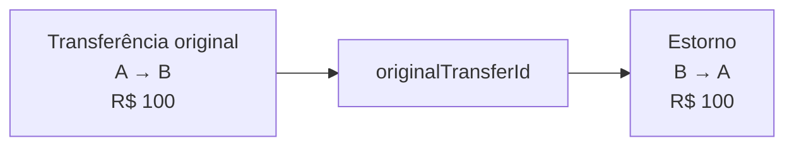

# ADR-0025 — Estorno como nova transferência imutável

## Status

Aceito em 2026-09-30.

## Contexto

Transferências concluídas são fatos financeiros imutáveis conforme o ADR-0005. Hoje uma operação
incorreta não pode ser corrigida pelo sistema, e adicionar `PUT`, `DELETE` ou alterar o status e os
saldos históricos apagaria o que realmente ocorreu.

O PayFlow precisa representar a compensação de uma transferência sem prometer integração bancária,
estorno parcial, cancelamento de operação pendente ou devolução de meios de pagamento externos.

## Decisão

Implementar **estorno integral** como uma nova transferência concluída, ligada à transferência
original. O registro original não muda e seus débitos e créditos não são reescritos.



O estorno terá:

- novo `id`, `createdAt` e `idempotencyKey`;
- tipo `REVERSAL`;
- `originalTransferId` obrigatório e único;
- origem e destino invertidos;
- mesmo valor e moeda da transferência original;
- status `COMPLETED`, sem editar o status da operação original.

Transferências já existentes serão classificadas como `INTERNAL_TRANSFER`. A API continuará sem
oferecer `PUT` ou `DELETE`.

## Contrato HTTP

```http
POST /api/v1/transfers/{transferId}/reversals
Authorization: Bearer <token>
Idempotency-Key: <uuid>
```

O corpo será vazio porque valor, moeda e contas vêm da operação original. A primeira execução retorna
`201 Created`. Repetir a mesma chave retorna o mesmo estorno. Uma chave diferente para uma
transferência já estornada retorna `409 Conflict`, sem movimentar saldo novamente.

## Regras de negócio

1. apenas o usuário que criou a transferência original pode solicitar o estorno;
2. origem e destino da operação original devem continuar pertencendo ao mesmo usuário; transferências
   para terceiros não admitem débito unilateral do recebedor;
3. somente `INTERNAL_TRANSFER` concluída pode ser estornada;
4. cada transferência admite no máximo um estorno integral;
5. um estorno não pode ser estornado;
6. as duas contas são bloqueadas na mesma ordem determinística usada na transferência;
7. a conta de destino original deve possuir saldo suficiente para devolver o valor;
8. criação do estorno, movimentação dos saldos e outbox pertencem à mesma transação PostgreSQL;
9. concorrência entre duas solicitações não pode produzir dois estornos.

Recursos que não pertencem ao usuário serão respondidos como inexistentes para não revelar dados de
outras pessoas. Saldo insuficiente continua usando `422 Unprocessable Entity`.

## Evento

Ao concluir o estorno, a outbox registra `TransferReversed.v1`, contendo identificadores do evento,
estorno, transferência original e contas, além de valor, moeda, instante e `correlationId`. O evento
não transporta dados pessoais.

O consumidor de auditoria deve deduplicá-lo com a mesma semântica de entrega pelo menos uma vez já
usada por `TransferCompleted.v1`.

## Implementação incremental

1. **M5.1.1 — domínio e API:** migration, modelo, serviço, endpoint e testes concorrentes;
2. **M5.1.2 — evento e auditoria:** `TransferReversed.v1`, outbox, relay e projeção auditável;
3. **M5.1.3 — front-end:** ação de estorno, confirmação, retorno visual e atualização dos saldos;
4. **M5.1.4 — qualidade:** E2E, métricas, OpenAPI, documentação e preparação de release.

Cada incremento deve terminar executável e não depende da extração do Audit Service.

Os quatro incrementos do M5.1 estão implementados. O fluxo de interface mantém uma chave idempotente
por tentativa, exige confirmação explícita e atualiza contas e histórico após o sucesso. O caminho
completo possui E2E, métricas próprias, contrato OpenAPI e notas preparadas para a versão 0.5.0.

## Consequências

O histórico passa a explicar tanto a operação original quanto sua compensação. O modelo fica mais
próximo de um ledger auditável e preserva a imutabilidade.

Em contrapartida, a devolução pode falhar se o saldo já tiver sido consumido. Estorno parcial,
aprovação manual, prazo limite, taxas, fraude e integração externa continuam fora do escopo.

## Relação com decisões anteriores

- concretiza a correção futura prevista no ADR-0005;
- mantém PostgreSQL como fonte de verdade conforme o ADR-0002;
- reutiliza concorrência e idempotência dos ADRs 0015 e 0021;
- usa a outbox e a auditoria definidas pelo ADR-0023;
- não altera o adiamento do Audit Service decidido no ADR-0024.

## Estado da implementação

- M5.1.1 concluído com migration, domínio, endpoint, idempotência e testes concorrentes;
- M5.1.2 concluído com `TransferReversed.v1`, outbox atômica, tópico
  `payflow.transfer-events.v1` e projeção de auditoria ligada à transferência original.
