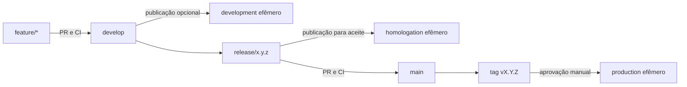
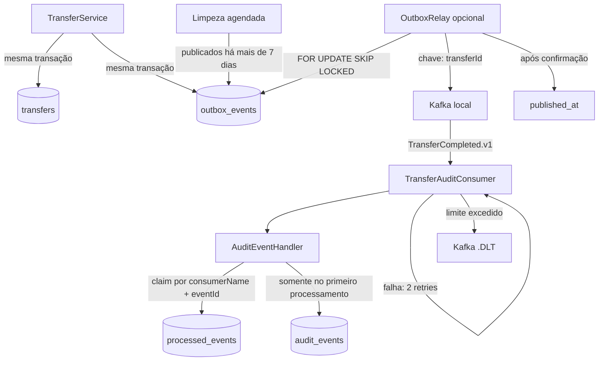

# Arquitetura

## Arquitetura inicial

```text
Browser
  |
  | HTTPS
  v
Caddy (EC2)
  |--------------------|
  v                    v
React estático     Spring Boot API
                         |
                         v
                    PostgreSQL
```

No desenvolvimento, os mesmos componentes são iniciados por Docker Compose. No primeiro deploy, ficam em uma única instância para reduzir custo, quantidade de recursos e esforço operacional. Containers e módulos mantêm caminhos de evolução sem prometer escalabilidade que a POC ainda não precisa.

A fundação AWS é descrita em Terraform: VPC, subnet pública, Security Group, EC2, Elastic IP,
identidade da instância e bucket privado de backup. O state fica em um bucket S3 de bootstrap,
separado do ciclo de vida da aplicação. A CI valida a configuração, mas não executa `apply` em Pull
Requests.

## Evolução do fluxo de entrega

O [ADR-0020](adr/0020-git-flow-environments-and-semantic-versioning.md) define a adoção incremental de
Git Flow, versionamento semântico e promoção entre ambientes. A topologia AWS de cada estágio só será
criada quando seu isolamento de state, identidade, configuração e dados estiver implementado.



Pull Requests de feature não criam infraestrutura AWS. Development, homologation e production ficam
desligados por padrão e usam TTL quando publicados, preservando o objetivo de baixo custo.
O estado atual e a ordem segura de implementação estão em [Ambientes e promoção](environments.md).

## Módulos do back-end

```text
auth          cadastro, login e tokens
accounts      propriedade e consulta de saldo
transfers     regras e execução atômica
events        contrato, outbox, relay e auditoria opcional por Kafka local
shared        erros e infraestrutura transversal mínima
```

Cada módulo pode conter `api`, `application`, `domain` e `infrastructure`, mas pacotes só devem existir quando tiverem conteúdo real. A API chama casos de uso; regras de saldo não ficam em controllers.

## Organização do front-end

```text
src/
├── app/                 composição e estado compartilhado da tela
├── features/
│   ├── accounts/
│   │   └── list-accounts/
│   └── transfers/
│       ├── create-transfer/
│       └── list-transfers/
└── shared/              cliente HTTP, formatadores e estilos globais
```

O front-end é organizado por domínio e caso de uso. Cada caso pode conter modelo, service, coordenação, componentes internos e testes colocalizados. Código começa dentro da feature que o utiliza e só vai para `shared` quando for realmente transversal. Bibliotecas de cache, roteamento e estado global serão adicionadas apenas quando a aplicação apresentar essas necessidades.

## Modelo mínimo

- `users`: identidade e credenciais.
- `accounts`: proprietário, moeda e saldo atual.
- `transfers`: origem, destino, valor, status, chave de idempotência e timestamps.
- `outbox_events`: eventos de domínio gravados atomicamente e ainda não publicados.
- `processed_events`: eventos reivindicados por consumidor para impedir efeitos duplicados.
- `audit_events`: projeção consultável dos eventos de transferência consumidos.

Restrições essenciais:

- valor maior que zero;
- origem diferente do destino;
- mesma moeda no M0/M1;
- saldo nunca negativo;
- débito e crédito na mesma transação de banco;
- chave de idempotência única por usuário;
- transferência concluída não pode ser editada ou removida.

## Arquitetura futura

```text
React -> Transaction API -> PostgreSQL
                 |
                 v
          Transactional Outbox
                 |
                 v
               Kafka
              /     \
             v       v
        Audit       Notification
        Service       Service
           |
           v
        MongoDB
```

Kafka não participa da confirmação financeira. PostgreSQL continua sendo a fonte de verdade; a outbox impede o intervalo inconsistente entre salvar a transferência e publicar seu evento.

## Eventos implementados no M3.4



O Compose comum continua com front-end, API e PostgreSQL. `compose.events.yaml` acrescenta um broker
Kafka local em modo KRaft e habilita o relay. O relay está desabilitado por padrão e não altera o
deploy AWS. A entrega é pelo menos uma vez: uma falha entre a confirmação do broker e o commit do
banco pode provocar reenvio. O consumidor reivindica atomicamente o par `consumerName + eventId` e
só cria a auditoria quando esse par ainda não existe. Evento repetido é confirmado sem repetir o
efeito.

O relay persiste cada tentativa e para automaticamente após cinco falhas, preservando o registro
esgotado para diagnóstico. O consumidor faz duas retentativas além da entrega inicial; persistindo a
falha, o payload original segue para o tópico DLT com os headers de diagnóstico do Kafka. Eventos
publicados e mensagens dos tópicos possuem retenção padrão de sete dias. Logs do relay e do handler
reutilizam o `correlationId` criado na requisição original.

O plano incremental e a semântica de entrega estão definidos no
[ADR-0023](adr/0023-transactional-outbox-before-kafka.md). A outbox, o relay e o consumidor de
auditoria, retentativas, DLT, retenção, métricas e rastreabilidade já estão implementados localmente.
Kafka continua opcional e não foi adicionado à AWS.

## Segurança e limites

- O sistema representa dinheiro fictício e não processa pagamentos reais.
- Senhas são armazenadas com hash adaptativo suportado pelo Spring Security.
- Autorização é verificada por recurso, não apenas pela presença do token.
- Segredos não ficam em imagens, Compose versionado ou logs.
- Logs não incluem senha, token completo ou dados pessoais desnecessários.
