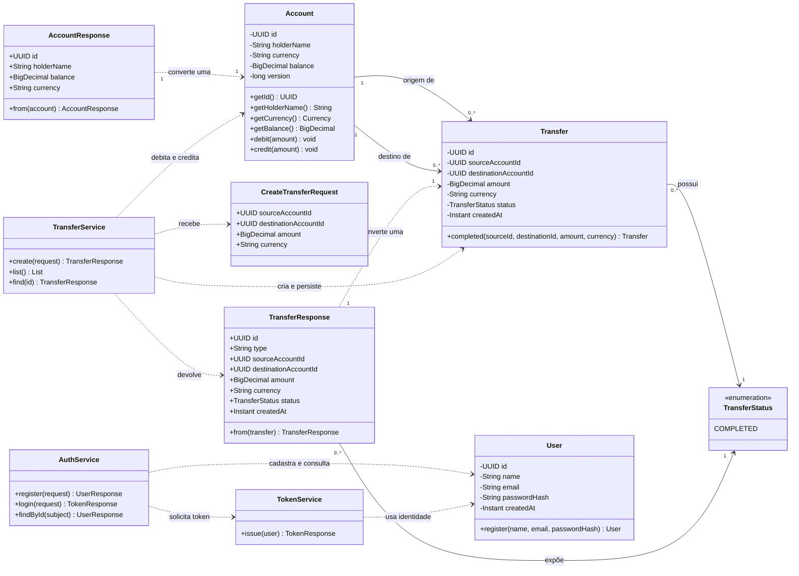
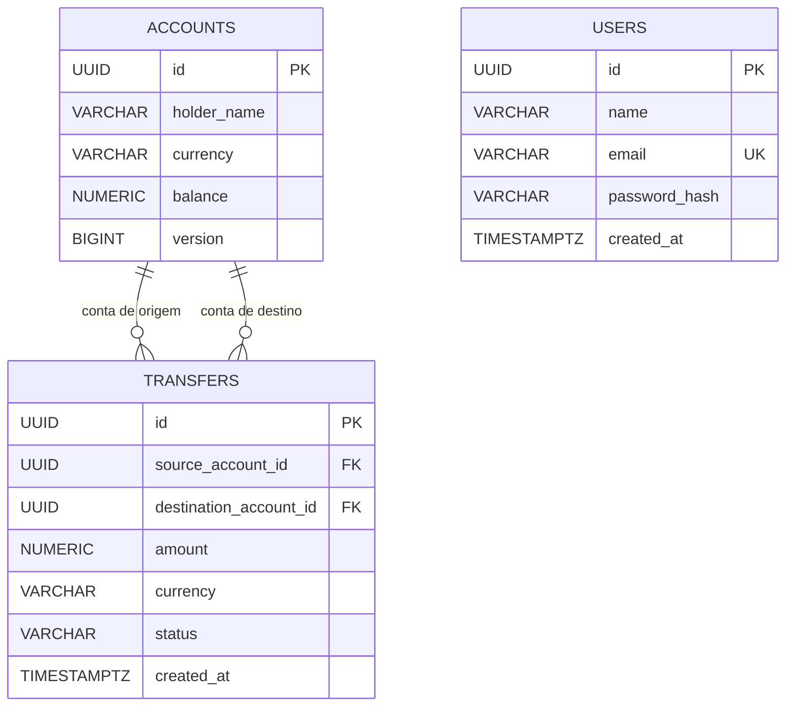
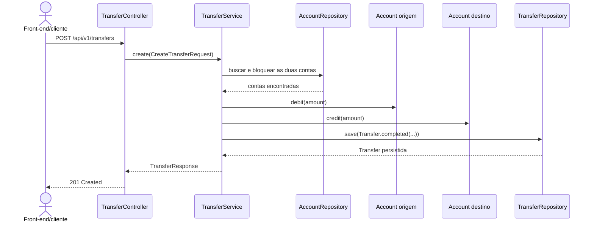

# Modelo de classes

Este documento representa o modelo **implementado atualmente no M0**. Ele separa entidades persistidas, objetos do contrato HTTP e serviços responsáveis pelo fluxo de transferência.

## Visão geral das classes

### Legenda das cardinalidades e relacionamentos

| Símbolo | Leitura                                                                               |
| ------- | ------------------------------------------------------------------------------------- |
| `1`     | exatamente uma instância                                                              |
| `0..1`  | nenhuma ou uma instância                                                              |
| `0..*`  | nenhuma, uma ou muitas instâncias                                                     |
| `-->`   | associação: uma classe possui ou está relacionada à outra                             |
| `..>`   | dependência: uma classe usa a outra temporariamente, por exemplo para converter dados |

Exemplos do diagrama:

- cada `Transfer` possui exatamente um `TransferStatus`;
- um mesmo `TransferStatus`, como `COMPLETED`, pode aparecer em zero ou muitas transferências;
- cada transferência possui exatamente uma conta de origem e uma conta de destino;
- uma conta pode não ter nenhuma transferência ou participar de muitas;
- cada `TransferResponse` é criado a partir de exatamente uma `Transfer`.

As duas associações entre `Account` e `Transfer` representam o relacionamento do domínio e do banco. No código Java, `Transfer` armazena `sourceAccountId` e `destinationAccountId` como UUIDs; ela não mantém campos do tipo `Account` nem associações JPA como `@ManyToOne`.

As dependências do `TransferService` não recebem cardinalidade porque representam chamadas temporárias durante um caso de uso, e não objetos mantidos como parte permanente do modelo.

## Entidades persistidas

`User`, `Account` e `Transfer` são entidades JPA. Seus dados são armazenados respectivamente nas tabelas `users`, `accounts` e `transfers`.

Uma conta pode participar de zero ou muitas transferências como origem e de zero ou muitas como destino. No Java, `Transfer` guarda apenas os identificadores das contas, em vez de carregar objetos `Account`. Isso mantém o registro financeiro simples e evita associações JPA desnecessárias.

## Responsabilidade das classes

| Classe                  | Tipo                 | Responsabilidade                                               |
| ----------------------- | -------------------- | -------------------------------------------------------------- |
| `Account`               | entidade JPA         | manter saldo e aplicar as regras de débito e crédito           |
| `Transfer`              | entidade JPA         | representar o registro imutável de uma transferência concluída |
| `TransferStatus`        | enum                 | limitar os estados válidos da transferência                    |
| `CreateTransferRequest` | DTO de entrada       | receber e validar os dados enviados pelo cliente               |
| `AccountResponse`       | DTO de saída         | expor uma conta sem devolver diretamente a entidade JPA        |
| `TransferResponse`      | DTO de saída         | expor uma transferência no contrato HTTP                       |
| `TransferService`       | serviço de aplicação | coordenar validações, débito, crédito e persistência atômica   |
| `User`                  | entidade JPA         | armazenar identidade, e-mail normalizado e hash da senha       |
| `AuthService`           | serviço de aplicação | coordenar cadastro, login e consulta do usuário                |
| `TokenService`          | serviço de segurança | emitir access token JWT com validade curta                     |

DTO significa **Data Transfer Object**: objeto usado para transportar dados entre a API e seus consumidores. Separar DTOs das entidades impede que mudanças internas do banco alterem acidentalmente o contrato HTTP.

## Fluxo de criação de transferência

O método do serviço é transacional: débito, crédito e criação da transferência formam uma única operação. Se uma regra falhar, como saldo insuficiente, nenhuma parte deve permanecer gravada.

## Regras representadas no modelo

- dinheiro usa `BigDecimal` no Java e `NUMERIC(19,2)` no PostgreSQL;
- `Account.debit` impede que o saldo fique negativo;
- origem e destino devem ser contas diferentes;
- valor deve ser maior que zero e ter no máximo duas casas decimais;
- as duas contas devem usar a moeda informada;
- uma transferência criada neste marco recebe o estado `COMPLETED`;
- transferências concluídas não possuem operação de alteração ou exclusão;
- `Account.version` oferece suporte a controle de concorrência otimista pelo JPA.

## Evolução planejada

O modelo acima mostra somente o que existe no código. A associação entre `User` e `Account`, a chave de idempotência e o estorno pertencem aos próximos passos do M1 e devem ser adicionados ao diagrama apenas quando forem implementados.
