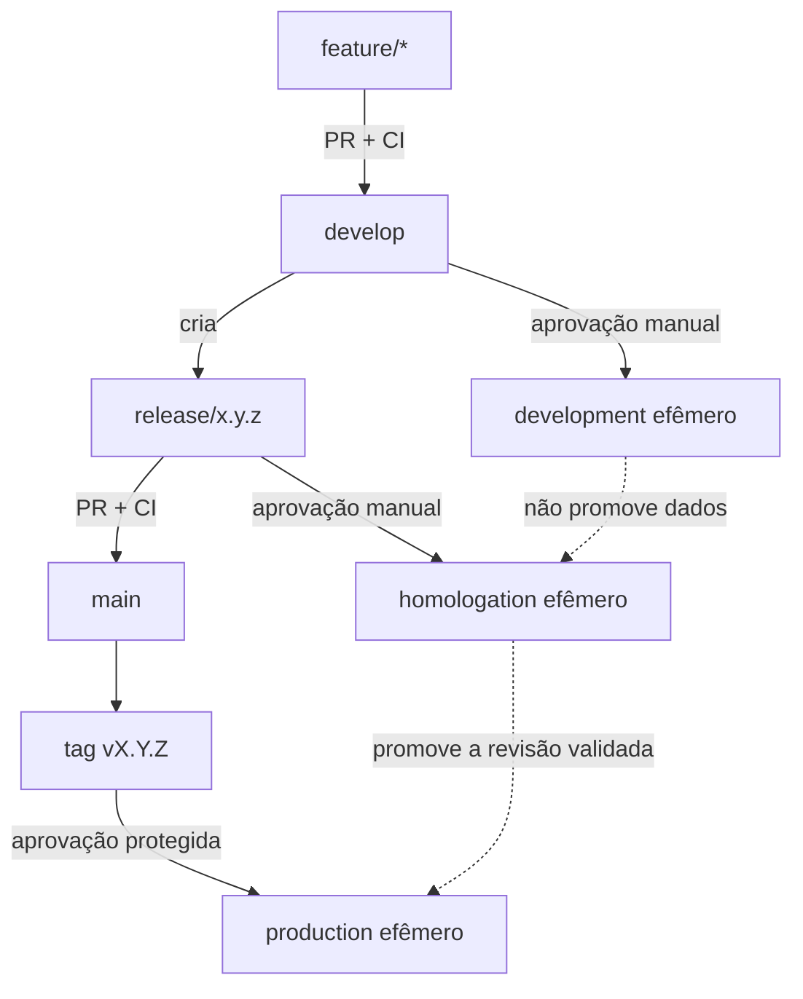

# Ambientes e promoção

Este documento transforma a decisão do ADR-0020 em um plano operacional incremental. Separar nomes
de ambientes no GitHub não é suficiente: cada ambiente AWS precisa isolar configuração, credenciais,
state, lease de TTL e dados.

## Estado atual

| Ambiente       | Origem prevista | GitHub Environment | Infraestrutura AWS | Estado             |
| -------------- | --------------- | ------------------ | ------------------ | ------------------ |
| `development`  | `develop`       | ainda não criado   | ainda não criada   | planejado          |
| `homologation` | `release/*`     | ainda não criado   | ainda não criada   | planejado          |
| `production`   | tag em `main`   | configurado        | efêmera com TTL    | implementado no M1 |

O workflow existente ainda permite selecionar uma revisão manualmente e publica somente no ambiente
`production`. Ele continuará sendo a fonte operacional válida até a migração terminar.

## Fluxo-alvo

Promover significa usar a mesma revisão validada, e não copiar banco, secrets ou estado entre
ambientes. Nesta primeira evolução, a revisão será identificada pelo SHA do commit ou pela tag. A
promoção de uma imagem Docker imutável ficará para uma etapa posterior.

## Isolamento obrigatório

Cada ambiente deverá ter valores próprios para:

- GitHub Environment e suas regras de aprovação;
- roles AWS assumidas pelo GitHub OIDC;
- chave do state Terraform no S3;
- arquivo de lease usado pelo TTL e pela limpeza automática;
- parâmetro `SecureString` do runtime no Systems Manager;
- secrets `POSTGRES_PASSWORD` e `JWT_SECRET`;
- tags AWS, nomes de recursos e dados do PostgreSQL;
- URL pública e valor de CORS.

Nenhum banco, senha, token ou arquivo Terraform state será promovido entre ambientes.

## Ordem de implementação

### 1. Tornar o workflow consciente do ambiente

Extrair os valores hoje fixos em `production` para entradas controladas e mapas explícitos. O workflow
deverá rejeitar combinações inválidas entre revisão e ambiente.

### 2. Criar `development`

Adicionar state, identidade, configuração e limpeza exclusivos. A publicação será manual a partir de
`develop`, efêmera e sem aprovação obrigatória inicialmente.

### 3. Criar `homologation`

Adicionar o mesmo isolamento, mas aceitar somente revisões `release/*`. Esse ambiente serve para o
aceite da versão candidata antes do merge na `main`.

### 4. Restringir `production`

Depois que os dois ambientes anteriores estiverem comprovados, produção aceitará somente tags
`vX.Y.Z` existentes e poderá exigir um revisor no GitHub Environment.

### 5. Promover artefatos imutáveis

Construir as imagens uma vez, identificá-las por digest e promover exatamente os mesmos artefatos.
Essa etapa evita que builds separados da mesma revisão produzam resultados diferentes, mas não é
necessária para criar os primeiros ambientes isolados.

## Custos e segurança

Criar `development` e `homologation` não significa mantê-los ligados. Todos continuam manuais,
efêmeros e protegidos por TTL. A implementação deve reutilizar módulos Terraform, mas nunca o mesmo
state ou banco. Pull Requests comuns executam apenas validação e não criam recursos AWS.

## Critério de conclusão do primeiro incremento

O planejamento estará pronto quando o estado real estiver documentado, sem representar ambientes
planejados como existentes. A implementação seguinte deverá começar por `development`, provar seu
isolamento e sua limpeza automática e somente depois repetir o padrão para `homologation`.
