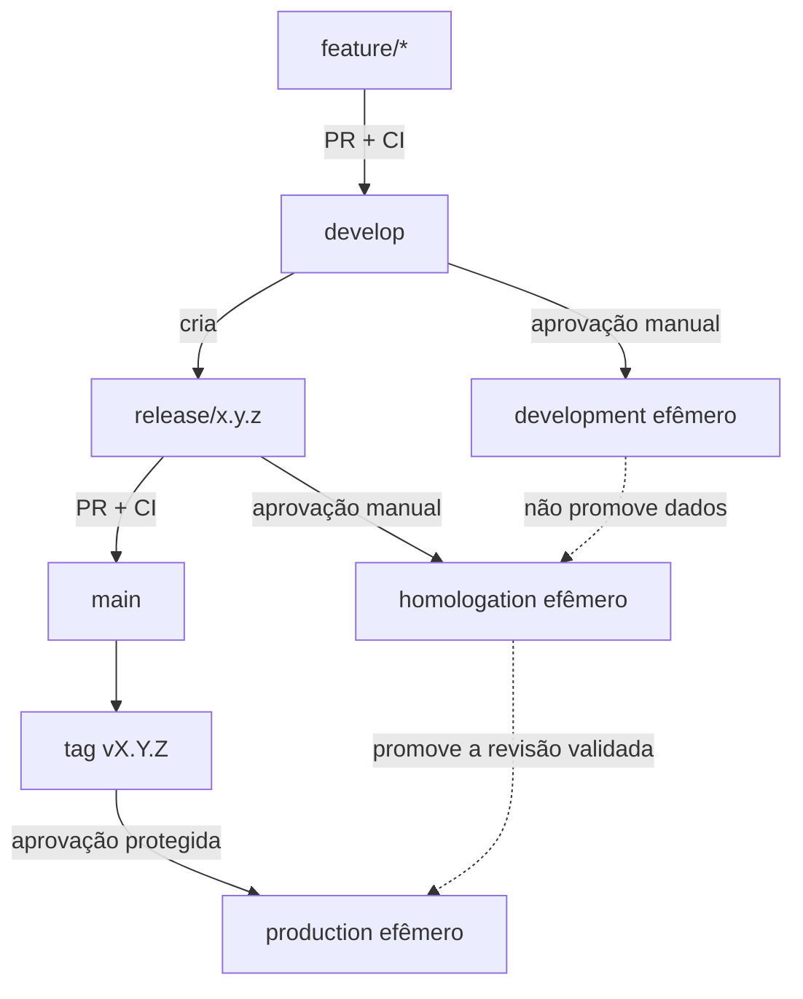

# Ambientes e promoção

Este documento transforma a decisão do ADR-0020 em um plano operacional incremental. Separar nomes
de ambientes no GitHub não é suficiente: cada ambiente AWS precisa isolar configuração, credenciais,
state, lease de TTL e dados.

## Estado atual

| Ambiente       | Origem prevista | GitHub Environment | Infraestrutura AWS | Estado             |
| -------------- | --------------- | ------------------ | ------------------ | ------------------ |
| `development`  | `develop`       | configurado        | efêmera com TTL    | pronto para teste  |
| `homologation` | `release/*`     | ainda não criado   | ainda não criada   | planejado          |
| `production`   | tag em `main`   | configurado        | efêmera com TTL    | implementado no M1 |

O workflow publica `develop` em `development` e exige uma tag anotada `vX.Y.Z` para `production`.
`homologation` continua bloqueado até possuir isolamento equivalente. O watchdog agendado permanece
em produção; development é destruído ao final do próprio job e possui limpeza manual de emergência.

## Fluxo-alvo

```mermaid
flowchart TB
    Feature[feature/*] -->|PR + CI| Develop[develop]
    Develop -->|aprovação manual| Dev[development efêmero]
    Develop -->|cria| Release[release/x.y.z]
    Release -->|aprovação manual| Hom[homologation efêmero]
    Release -->|PR + CI| Main[main]
    Main --> Tag[tag vX.Y.Z]
    Tag -->|aprovação protegida| Prod[production efêmero]

    Dev -.não promove dados.-> Hom
    Hom -.promove a revisão validada.-> Prod
```

Promover significa usar a mesma revisão validada, e não copiar banco, secrets ou estado entre
ambientes. Nesta primeira evolução, a revisão será identificada pelo SHA do commit ou pela tag. A
promoção de uma imagem Docker imutável ficará para uma etapa posterior.

## Isolamento obrigatório

Cada ambiente deverá ter valores próprios para:

- GitHub Environment e suas regras de aprovação;
- roles AWS assumidas pelo GitHub OIDC;
- chave do state Terraform no S3;
- arquivo de lease usado pelo TTL e pela limpeza automática;
- parâmetro `SecureString` do runtime no Systems Manager;
- secrets `POSTGRES_PASSWORD` e `JWT_SECRET`;
- tags AWS, nomes de recursos e dados do PostgreSQL;
- URL pública e valor de CORS.

Nenhum banco, senha, token ou arquivo Terraform state será promovido entre ambientes.

## Ordem de implementação

### 1. Tornar o workflow consciente do ambiente

Extrair os valores hoje fixos em `production` para entradas controladas e mapas explícitos. O workflow
deverá rejeitar combinações inválidas entre revisão e ambiente.

Estado: implementado na política e no workflow. `production` e `development` estão habilitados;
`homologation` permanece bloqueado até a etapa seguinte.

### 2. Criar `development`

Adicionar state, identidade, configuração e limpeza exclusivos. A publicação será manual a partir de
`develop`, efêmera e sem aprovação obrigatória inicialmente.

Preparação no repositório:

- reutilizar o root Terraform parametrizado, sem copiar recursos;
- state da aplicação em `payflow/development/terraform.tfstate`;
- state da identidade em `payflow/bootstrap/development-identity.tfstate`;
- roles `payflow-development-*` confiando somente no Environment `development`;
- SSM `/payflow/development/runtime-env` e lease `payflow/leases/development.json`;
- a opção de publicação permaneceu bloqueada até a conclusão do bootstrap e o cadastro de
  secrets/variables.

Estado: identidade AWS e GitHub Environment configurados. A publicação e a limpeza manual estão
habilitadas; falta executar o primeiro teste efêmero e confirmar a destruição ao final do TTL.

### 3. Criar `homologation`

Adicionar o mesmo isolamento, mas aceitar somente revisões `release/*`. Esse ambiente serve para o
aceite da versão candidata antes do merge na `main`.

### 4. Restringir `production`

Depois que os dois ambientes anteriores estiverem comprovados, produção aceitará somente tags
`vX.Y.Z` existentes e poderá exigir um revisor no GitHub Environment.

### 5. Promover artefatos imutáveis

Construir as imagens uma vez, identificá-las por digest e promover exatamente os mesmos artefatos.
Essa etapa evita que builds separados da mesma revisão produzam resultados diferentes, mas não é
necessária para criar os primeiros ambientes isolados.

## Custos e segurança

Criar `development` e `homologation` não significa mantê-los ligados. Todos continuam manuais,
efêmeros e protegidos por TTL. A implementação deve reutilizar módulos Terraform, mas nunca o mesmo
state ou banco. Pull Requests comuns executam apenas validação e não criam recursos AWS.

## Critério de conclusão do primeiro incremento

O primeiro incremento será concluído quando `development` comprovar em uma execução real seu
isolamento e sua limpeza automática. Somente depois o mesmo padrão será aplicado a `homologation`.
