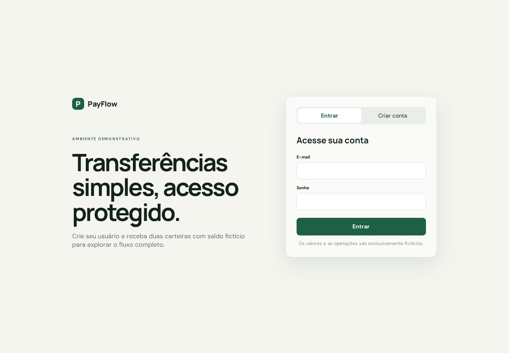

# Prontidão do portfólio

Esta avaliação reúne evidências verificáveis do PayFlow sem apresentar a PoC como um sistema bancário
de produção. A revisão foi concluída após a publicação da versão `v0.4.0`.

## Resultado

| Critério                           | Estado   | Evidência ou limitação                                                                           |
| ---------------------------------- | -------- | ------------------------------------------------------------------------------------------------ |
| Fluxo público validado             | Atendido | A `v0.4.0` foi promovida em homologação e produção; a URL é temporária por decisão do ADR-0019.  |
| README, diagramas, ADRs e execução | Atendido | O README referencia arquitetura, domínio, API, ambientes, observabilidade e ADRs.                |
| Dados exclusivamente fictícios     | Atendido | Interface, OpenAPI e modelo identificam explicitamente o caráter demonstrativo.                  |
| Pipeline verde                     | Atendido | Pull Requests exigem front-end, back-end, E2E, Terraform, Compose e SonarQube.                   |
| Demonstração visual                | Atendido | Capturas reais do login e do dashboard ficam em `docs/assets/portfolio/`.                        |
| Decisões explicáveis               | Atendido | Os ADRs registram contexto, decisão e consequências das escolhas principais.                     |
| Custos e desligamento              | Atendido | O ADR-0019 define TTL e destruição; o budget persistente alerta sobre o teto mensal configurado. |

## Limitações intencionais

- não existe URL permanente: cada publicação cria uma URL HTTP temporária e a remove ao final do TTL;
- HTTPS depende da adoção futura de um domínio validável;
- Kafka permanece local e opcional, sem broker pago em cloud;
- a topologia de uma EC2 é adequada à demonstração, não uma recomendação para um sistema financeiro
  real;
- AWS Budgets envia alertas, mas não bloqueia cobranças nem garante custo zero.

## Custo mensal e desligamento

O valor de referência do projeto é um orçamento mensal de **US$ 5**, configurável no bootstrap de
custos. Esse valor é um limite operacional para alertas, não uma previsão exata nem um bloqueio de
cobrança. A despesa efetiva varia com preços da região, tempo de execução e tráfego.

| Componente                          | Ciclo de vida | Controle adotado                                    |
| ----------------------------------- | ------------- | --------------------------------------------------- |
| EC2, volume, IPv4 e alarmes         | Efêmero       | Removidos automaticamente ao final do TTL.          |
| Parâmetro SSM do runtime            | Efêmero       | Removido e verificado antes do `terraform destroy`. |
| Bucket de backup do ambiente        | Efêmero       | Destruído com o ambiente.                           |
| State, identidade OIDC e AWS Budget | Persistente   | Fundação mínima; não executa a aplicação.           |

Os alertas são disparados em 50% e 80% do custo real e em 100% do custo previsto. O procedimento de
desligamento normal é automático; em uma contingência, o workflow de cleanup usa a lease do ambiente
para executar a mesma remoção e destruição.

## Capturas

### Login



### Dashboard após transferência


## Reproduzir as capturas

Com Docker e o Chromium do Playwright instalados:

```bash
docker compose up --build --wait
cd frontend
npm run docs:screenshots
```

O script cria um usuário descartável, autentica, realiza uma transferência fictícia e substitui as
imagens em `docs/assets/portfolio/`. Para encerrar o ambiente:

```bash
docker compose down
```

## Publicação sob demanda

A demonstração AWS deve ser iniciada manualmente pelo workflow `AWS Ephemeral PoC`, no Environment
adequado, e aprovada quando a proteção exigir. O procedimento de publicação, health check, TTL,
remoção do parâmetro temporário e `terraform destroy` está documentado em
[`environments.md`](environments.md).
