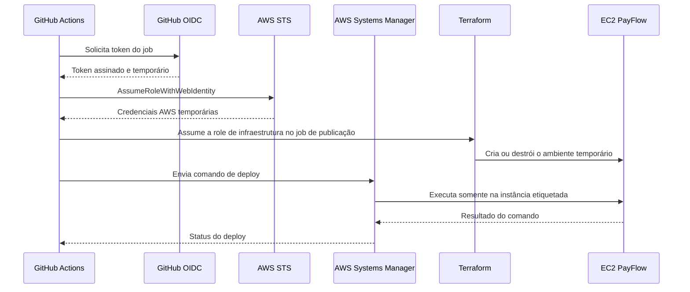

# Bootstrap de identidade GitHub Actions

Este módulo configura duas credenciais temporárias do GitHub Actions: uma para deploy por AWS Systems
Manager e outra para o ciclo de vida da infraestrutura efêmera.
Ele depende do bucket criado por `infra/bootstrap/state`.

## Verificar provider existente

Depois do login SSO:

```bash
aws iam list-open-id-connect-providers --profile operations-hub
```

Se existir um ARN terminado em `oidc-provider/token.actions.githubusercontent.com`, copie-o para
`existing_github_oidc_provider_arn` no `terraform.tfvars`. Caso contrário, deixe a variável ausente e
o módulo criará o provider da conta.

## Fluxo



## GitHub Environment

Crie o environment `production` em:

```text
Repository -> Settings -> Environments -> New environment
```

Restrinja as deployment branches à `main`. Não configure required reviewers nesse Environment enquanto
o watchdog agendado depender dele: uma aprovação manual impediria a limpeza automática. A publicação
continua manual por `workflow_dispatch`, e mudanças no workflow chegam à `main` somente por Pull
Request. Depois do `apply`, salve os outputs como **Environment variables**:

| Output Terraform                 | Variável GitHub               |
| -------------------------------- | ----------------------------- |
| `github_deploy_role_arn`         | `AWS_DEPLOY_ROLE_ARN`         |
| `github_infrastructure_role_arn` | `AWS_INFRASTRUCTURE_ROLE_ARN` |

Os ARNs identificam roles e não são secrets. A role de deploy executa somente comandos SSM. A role de
infraestrutura gerencia os recursos temporários do módulo `production`, seu state e a concessão de
TTL. Ela não gerencia o bootstrap persistente nem o AWS Budget.

## Validar sem acessar a AWS

```bash
terraform init -backend=false
terraform validate
```

## Planejar depois do bootstrap do state

```bash
cp backend.hcl.example backend.hcl
cp terraform.tfvars.example terraform.tfvars
terraform init -backend-config=backend.hcl
terraform plan -out=identity.tfplan
terraform show identity.tfplan
```

`apply` não é executado pela CI e exige revisão explícita. Nenhuma role possui
`AdministratorAccess`; cada uma tem uma política inline diferente para sua responsabilidade.
