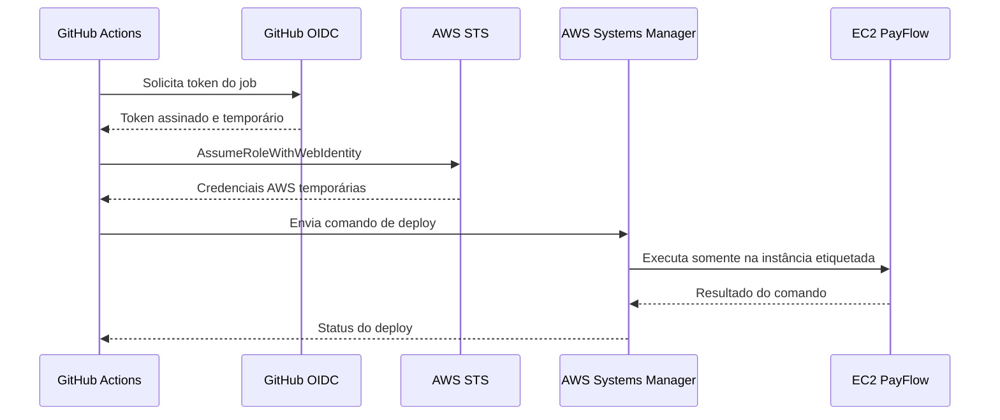

# Bootstrap de identidade GitHub Actions

Este módulo configura credenciais temporárias do GitHub Actions para deploy por AWS Systems Manager.
Ele depende do bucket criado por `infra/bootstrap/state`.

## Verificar provider existente

Depois do login SSO:

```bash
aws iam list-open-id-connect-providers --profile operations-hub
```

Se existir um ARN terminado em `oidc-provider/token.actions.githubusercontent.com`, copie-o para
`existing_github_oidc_provider_arn` no `terraform.tfvars`. Caso contrário, deixe a variável ausente e
o módulo criará o provider da conta.

## Fluxo



## GitHub Environment

Crie o environment `production` em:

```text
Repository -> Settings -> Environments -> New environment
```

Restrinja as deployment branches à `main` e, quando disponível no plano do GitHub, configure required
reviewers. Depois do `apply`, salve o output `github_deploy_role_arn` como uma **Environment variable**
chamada `AWS_DEPLOY_ROLE_ARN`. O ARN identifica uma role e não é secret.

## Validar sem acessar a AWS

```bash
terraform init -backend=false
terraform validate
```

## Planejar depois do bootstrap do state

```bash
cp backend.hcl.example backend.hcl
cp terraform.tfvars.example terraform.tfvars
terraform init -backend-config=backend.hcl
terraform plan -out=identity.tfplan
terraform show identity.tfplan
```

`apply` não é executado pela CI e exige revisão explícita. A role criada não provisiona infraestrutura,
não lê o state e não possui `AdministratorAccess`.
